# WPify Custom Fields

This library provides custom fields for WordPress and WooCommerce via simple API. The custom fields are stored in plain metadata so that you can access them via standard WordPress functionality. The frontend is written in React.js and has no dependencies in PHP. The library also doesn't include React itself but uses react as a dependency from WordPress. Therefore, the library is small and fast but requires at least WordPress 5.3.

[[_TOC_]]

## Overview

At the moment, you can add custom fields to the following locations:

* Post
* Taxonomy
* Options page
* WooCommerce product options
* WooCommerce membership plan options
* WooCommerce settings section
* User options

The custom fields themselves use the standard HTML inputs, so it's recommended to use Google Chrome or Firefox to use the custom fields. This allows having a small footprint and a speedy frontend for the custom fields. You have available wide variety of custom field types:

* Attachment `attachment`: Files and images from Media library.
* Checkbox `checkbox`
* Code `code`: For CSS, javascript, HTML, PHP, and other dialects.
* Color `color`
* Date `date`
* Datetime `datetime`
* E-mail `email`
* Group `group`: To save multiple custom fields in one object.
* HTML `html`: To print some piece of HTML in the settings.
* Inner Blocks `inner_blocks`: To use inner blocks in Gutenberg editor.
* Link `link`
* Mapy.cz `mapycz`: To enter coordinates of some place.
* Month `month`
* Number `number`
* Password `password`
* Post `post`: To select any post from any post type.
* Select `select`: Searchable select field.
* Phone number `tel`: The phone number input that enforces the user to put the standardized phone number in an
  international format.
* Textarea `textarea`
* Text `text`
* Time `time`
* Title `title`: To print the section title in the settings.
* Toggle `toggle`
* URL `url`
* Week `week`

Some fields also allow multiple values. You can also sort the values via drag&drop.

* Multiple Attachments `multi_attachment`
* Multiple Groups `multi_group`: The repeater allows you to have any custom fields repeated inside a group.
* Multiple Posts `multi_post`: Select multiple posts.
* Multiple Select `multi_select`: Select multiple values.

### Requirements

* PHP 7.3+ (we support only versions with security patches)
* Google Chrome/Firefox (the library uses native input fields that only some browsers support)
* WordPress 5.3 (the library requires React 16.8+ that was included in WordPress 5.2 and Gutenberg editor included in WordPress 5.3)

### Development requirements

If you want to help with the development of the library, feel free to extend that. In addition to the requirements above, you
will need also:

* Composer 2+
* Node 14+

## Example: Hello custom fields

The following example shows you how to add custom fields to a page and read the data.

1. Require the library in your plugin via composer:
   `composer require wpify/custom-fields`

2. Include composer autoloader in your plugin:
   `include_once __DIR__ . '/vendor/autoload.php';`

3. Create a new metabox with some text field:

```php
wpify_custom_fields()->create_metabox( array(
   // Metabox title
   'title'      => 'Hello custom fields',
   // Array of post types that will have the custom fields
   'post_types' => array( 'page' ),
   // Array of items for the metabox
   'items'      => array( 
      // Text field
      array(
         'type'  => 'text',
         'title' => 'Text label of the meta',
         'id'    => 'some_id_of_the_meta',
      ),
   ),
) );
```

That's it :)

# Implementations

## How to add custom fields to post type?

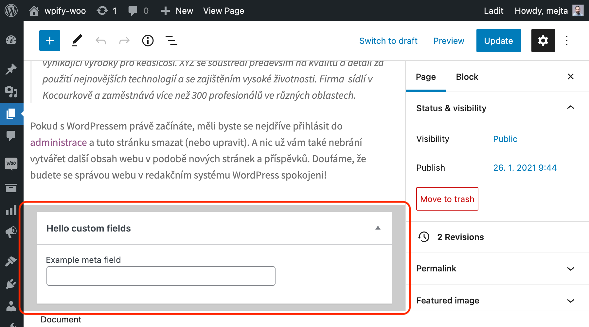

The example above shows the minimalistic example of how to add a metabox. Let's extend that with full list of options.
In snippet above, you can see all the options with their default values:

```php
wpify_custom_fields()->create_metabox( array(
   'id'            => null,
   'title'         => null,
   'screen'        => null,
   'context'       => 'advanced',
   'priority'      => 'default',
   'callback_args' => null,
   'items'         => array(),
   'post_types'    => array(),
   'display'       => function() {
	  // Conditional display
	  return true;
   },
) );
```

**Arguments**

* `id`, `title`, `screen`, `context`, `priority` and `callback_args`: See the WordPress documentation of `add_meta_box`
  function.
* `items`: array, required: List of the custom fields in the meta box.
* `post_types`: array, required: List of the post types with custom fields.

Please keep in mind that to have custom fields in the post type. For custom post type, add `custom-fields`
in `supports` array in `register_post_type` function, or use `add_post_type_support` function to add support to some
existing post type.

**Reading the custom fields**

To read the data, you can use simply built-in functions:

```php
$some_custom_field_value = get_post_meta( $post_id, 'some_id_of_the_meta', true );
```

**Links**

* `add_meta_box`: https://developer.wordpress.org/reference/functions/add_meta_box/
* `register_post_type`: https://developer.wordpress.org/reference/functions/register_post_type/
* `add_post_type_support`: https://developer.wordpress.org/reference/functions/add_post_type_support/
* `get_post_meta`: https://developer.wordpress.org/reference/functions/get_post_meta/

## How to add custom fields to the taxonomy term?

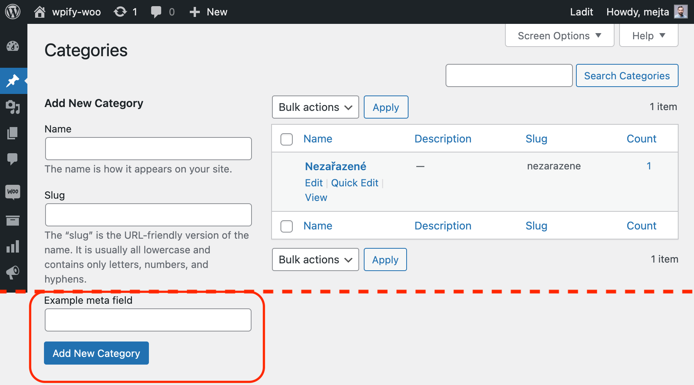

The functionality adds the meta box both on add and edit screen of taxonomy term:

```php
wpify_custom_fields()->create_taxonomy_options( array(
   'taxonomy' => null,
   'items'    => array(),
   'display'  => function() {
	  // Conditional display
	  return true;
   },
) );
```

**Arguments**

* `taxonomy` string, required. The taxonomy, to which terms you want to add custom fields, e.g. `category` for post category or `product_cat` for WooCommerce product category.
* `items`: array, required: List of the custom fields in the term.

**Reading the custom fields**

To read the data, you can use simply built-in functions:

```php
$some_custom_field_value = get_term_meta( $term_id, 'some_id_of_the_meta', true );
```

**Links**

* `get_term_meta`: https://developer.wordpress.org/reference/functions/get_term_meta/

## How to create an options page with custom fields?

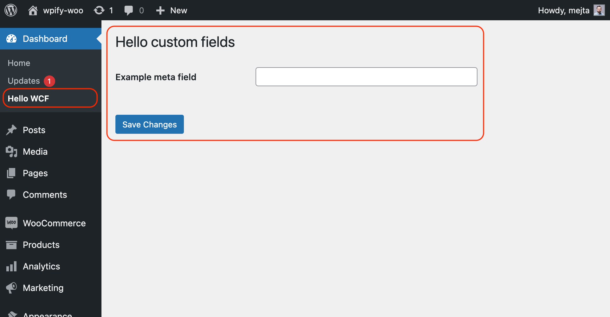

With this library, you can create options pages with ease on the top or second level. There are used core
function `add_menu_page` or `add_submenu_page` under the hood.

```php
wpify_custom_fields()->create_options_page( array(
   'type'        => 'normal',
   'parent_slug' => null,
   'page_title'  => '',
   'menu_title'  => '',
   'capability'  => 'manage_options',
   'menu_slug'   => null,
   'icon_url'    => null,
   'position'    => null,
   'items'       => array(),
   'display'     => function() {
	  // Conditional display
	  return true;
   },
) );
```

**Arguments**

* `type`: The only allowed value is `normal` (for standard option page) at the moment.
* `parent_slug`: If the options page is top-level, leave that `null`. If you want to add the page on second-level, add
  here the top-level page slug, e.g.:
	* `index.php` for Dashboard,
	* `edit.php` for Posts,
	* `upload.php` for Media,
	* `edit.php?post_type=page` for Pages,
	* `edit-comments.php` for Comments,
	* `edit.php?post_type=your_post_type` for your customs post types,
	* `themes.php` for Appearance,
	* `plugins.php` for Plugins,
	* `users.php` for Users,
	* `tools.php` for Tools,
	* `options-general.php` for Settings,
	* `settings.php` for Network Settings,
	* `woocommerce` for WooCommerce,
	* or any of your custom top-level menu slug.
* `page_title`: Title of the settings page.
* `menu_title`: Title of the settings page in the menu.
* `capability`: The capability the user needs to see the page.
* `menu_slug`: Unique menu slug of the page.
* `icon_url`: Icon for the top-level menu. Please see the documentation of `add_menu_page` to see how to add a menu
  icon.
* `position`: Position of the top-level menu page. Please see the documentation of `add_menu_page`.
* `items`: array, required: List of the custom fields in the options.

**Reading the custom fields**

```php
$some_custom_field_value = get_option( 'some_id_of_the_option' );
```

**Links**

* `add_submenu_page`: https://developer.wordpress.org/reference/functions/add_submenu_page/
* `add_menu_page`: https://developer.wordpress.org/reference/functions/add_menu_page/
* `get_option`: https://developer.wordpress.org/reference/functions/get_option/

## How to add custom fields to WooCommerce settings?

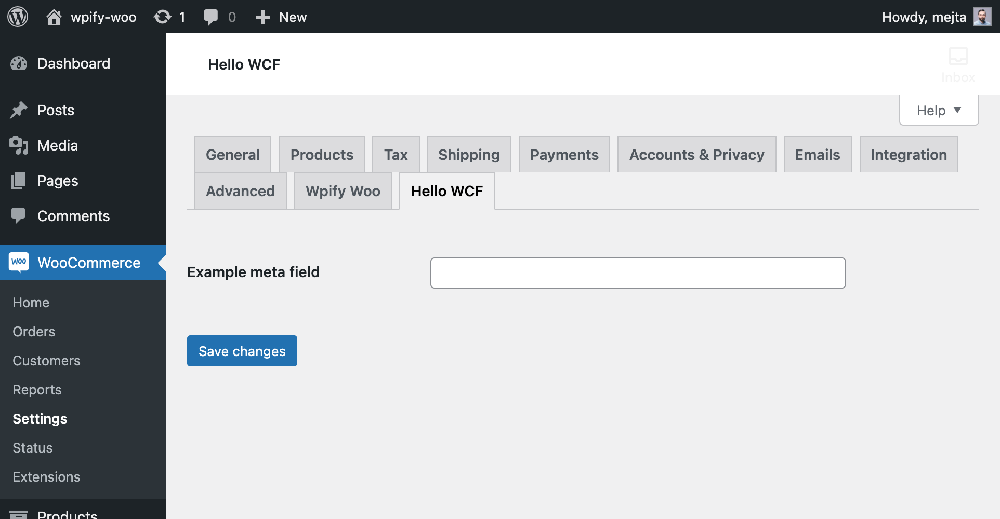

If you want to easily add the settings tab or section to the WooCommerce → Settings, you can easily do that with the
following piece of code:

```php
wpify_custom_fields()->create_woocommerce_settings( array(
   'tab'     => array( 'id' => '', 'label' => null ),
   'section' => array( 'id' => '', 'label' => null ),
   'items'   => array(),
   'display' => function() {
	  // Conditional display
	  return true;
   },
) );
```

**Arguments**

* `tab`: Identification of the tab. Please provide an array with `id` and `label` keys. If the tab doesn't exist, it will be created.
* `section`: Identification of the section. Please provide an array with `id` and `label` keys. If the section doesn't exist, it will be created.
* `items`: array, required: List of the custom fields in the settings.

**Reading the settings fields**

The WooCommerce settings is stores as standard options and you can read it as follows:

```php
$some_custom_field_value = get_option( 'some_id_of_the_option' );
```

**Links**

* `get_option`: https://developer.wordpress.org/reference/functions/get_option/

## How to add custom fields to the product options?

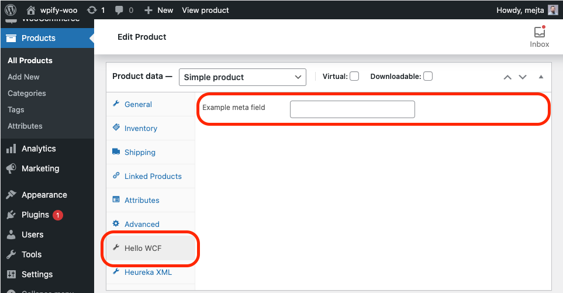

Product options is a great place where to put the custom fields. You can define it as follows:

```php
wpify_custom_fields()->create_product_options( array(
   'tab'          => array(
      'id'       => 'general',
      'label'    => null,
      'priority' => 100,
      'class'    => array(),
   ),
   'init_priority' => 10,
   'display'       => function() {
	  // Conditional display
	  return true;
   },
   'items'         => array(),
) );
```

**Arguments**

* `tab`: An array with tab settings. If the tab ID doesn't exist, it will be created.
	- `id`: ID of the tab.
	- `label`: Label of the tab.
	- `priority`: Priority of the tab.
	- `class`: Classes for the tab. You can use any classes you want, but also some built-in: `hide_if_grouped`
	  , `show_if_simple`, `show_if_variable`, `show_if_grouped`, `show_if_external`, `hide_if_external`
	  , `hide_if_virtual`
* `items`: array, required: List of the custom fields in the options.

**Reading the custom fields**

The product options are stored as post meta, so you can read the data the same way as any other post meta:

```php
$some_custom_field_value = get_post_meta( $product_id, 'some_id_of_the_meta', true );
```

**Links**

* `get_post_meta`: https://developer.wordpress.org/reference/functions/get_post_meta/


## How to add custom fields to the product variations?

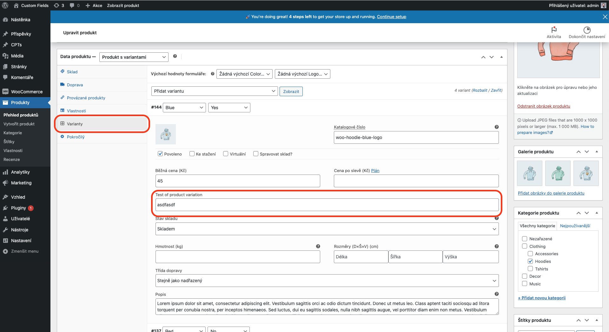

You can add custom fields to product variations as well. You can define it as follows:

```php
wpify_custom_fields()->create_product_variation_options( array(
   'after'          => 'pricing',
   'init_priority' => 10,
   'display'       => function() {
	  // Conditional display
	  return true;
   },
   'items'         => array(),
) );
```

**Arguments**

* `after`: Item, after which you want to place your custom fields. Possible options are: `pricing` _(default)_, `inventory`, `dimensions`, `download`, `attributes` _(after all fields)_.
* `items`: array, required: List of the custom fields in the options.

**Reading the custom fields**

The product options are stored as post meta, so you can read the data the same way as any other post meta:

```php
$some_custom_field_value = get_post_meta( $product_variation_id, 'some_id_of_the_meta', true );
```

**Links**

* `get_post_meta`: https://developer.wordpress.org/reference/functions/get_post_meta/

## How to add custom fields to the membership plan options?

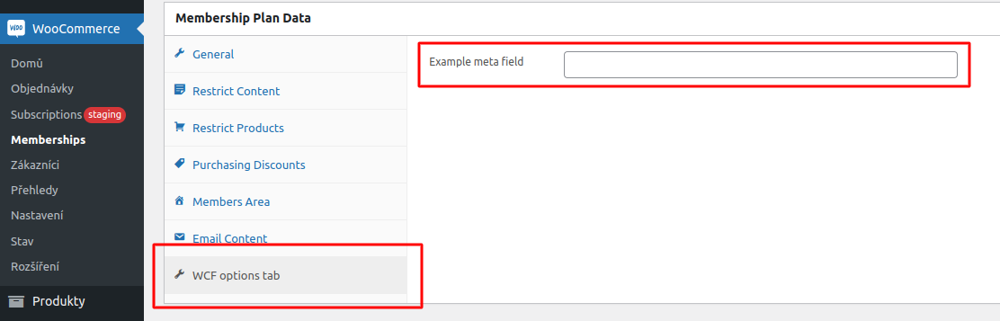

WooCommerce Membership plan options works similarly to product options. You can define it as follows:

```php
wpify_custom_fields()->create_membership_plan_options( array(
   'tab'          => array(
      'id'       => 'general',
      'label'    => null,
      'priority' => 100,
      'class'    => array(),
   ),
   'init_priority' => 10,
   'display'       => function() {
	  // Conditional display
	  return true;
   },
   'items'         => array(),
) );
```

**Arguments**

* `tab`: An array with tab settings. If the tab ID doesn't exist, it will be created.
	- `id`: ID of the tab.
	- `label`: Label of the tab.
	- `priority`: Priority of the tab.
	- `class`: Classes for the tab. You can use any classes you want, but also some built-in: `hide_if_grouped`
	  , `show_if_simple`, `show_if_variable`, `show_if_grouped`, `show_if_external`, `hide_if_external`
	  , `hide_if_virtual`
* `items`: array, required: List of the custom fields in the options.

**Reading the custom fields**

The membership plan options are stored as post meta, so you can read the data the same way as any other post meta:

```php
$some_custom_field_value = get_post_meta( $membership_plan_id, 'some_id_of_the_meta', true );
```

**Links**

* `get_post_meta`: https://developer.wordpress.org/reference/functions/get_post_meta/

## How to generate Gutenberg block with custom fields?

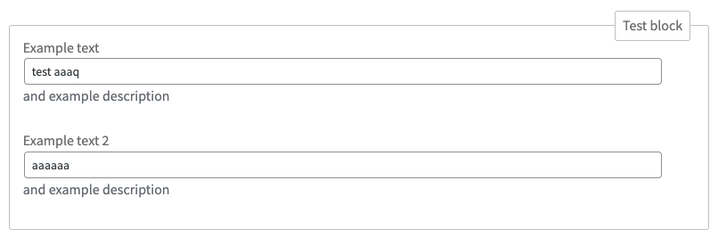

You can easily generate blocks that will use the custom fields interface. if you want to replace default custom fields interface with your own, simply set the `editor_script` and `editor_style` attributes with handle of your registered script and style. Every registered block also have `wcf` attribute, that contains the definition of the custom fields used in the block.

```php
wpify_custom_fields()->create_gutenberg_block( array(
	'name'             => null, // string
	'title'            => null, // string
	'category'         => 'common', // string
	'parent'           => null, // string
	'icon'             => null, // string
	'description'      => null, // string
	'keywords'         => array(), // array
	'textdomain'       => null, // string
	'styles'           => array(), // array
	'supports'         => null, // array
	'example'          => null, // array
	'render_callback'  => null, // callable
	'attributes'       => array(), // array
	'uses_context'     => array(), // array
	'provides_context' => null, // array
	'editor_script'    => null, // string
	'script'           => null, // string
	'editor_style'     => null, // string
	'style'            => null, // string
	'items'            => array(), // array
    'display'          => function() {
	  // Conditional display
	  return true;
   },
) );
```

**Arguments**

* `name`: Required name of the block in `namespace/block-name` format.
* `title`, `category`, `parent`, `icon`, `description`, `keywords`, `textdomain`, `styles`, `supports`, `example`, `render_callback`, `attributes`, `uses_context`, `provides_context`, `editor_script`, `script`, `editor_style` and `style` attributes are arguments described in `register_block_type` function.
* `items`: Required array: List of the custom fields in the options.

**Move attributes to sidebar**

If you want to move the particular attribute of the block to the sidebar, add an option to item `'position' => 'inspector'`.

**Links**

* `register_block_type`: https://developer.wordpress.org/reference/functions/register_block_type/

**Example**

```php
wpify_custom_fields()->create_gutenberg_block( array(
	'name'        => 'wcf/test',
	'title'       => 'Test block',
	'items'       => array(
		array(
			'type'        => 'text',
			'title'       => 'Example text',
			'id'          => 'some_example_text',
			'description' => 'and example description',
			'label'       => 'with example label',
		),
		array(
			'type'        => 'text',
			'title'       => 'Example text 2',
			'id'          => 'some_example_text_2',
			'description' => 'and example description',
			'label'       => 'with example label',
			'position'    => 'inspector',
		),
	),
	'render_callback' => function ( $attributes ) {
		return '<h2>' . $attributes['some_example_text'] . '</h2><p>' . $attributes['some_example_text'] . '</p>';
	},
) );
```

## How to add custom fields to the user?

The functionality adds options to the user:

```php
wpify_custom_fields()->create_user_options( array(
   'items'    => array(),
) );
```

**Arguments**

* `items`: array, required: List of the custom fields in the term.

**Reading the custom fields**

To read the data, you can use simply built-in functions:

```php
$some_custom_field_value = get_user_meta( $user_id, 'some_id_of_the_meta', true );
```

**Links**

* `get_user_meta`: https://developer.wordpress.org/reference/functions/get_user_meta/

## How to add custom fields to comments?

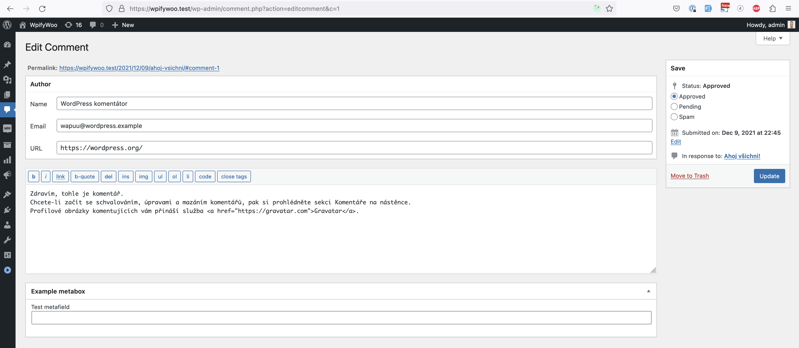

You can also easily add custom fields to comments:

```php
wpify_custom_fields()->create_comment_metabox( array(
   'id'    => 'cool_comments_metabox',
	'title' => __( 'Example metabox', '' ),
	'items' => array(
		array(
			'type'  => 'text',
			'id'    => 'test',
			'label' => 'Test metafield'
		),
	),
) );
```

**Arguments**

See post metabox for available arguments.

**Reading the custom fields**

To read the data, you can use simply built-in functions:

```php
$some_custom_field_value = get_comment_meta( $post_id, 'some_id_of_the_meta', true );
```

**Links**

* `add_meta_box`: https://developer.wordpress.org/reference/functions/add_meta_box/
* `get_comment_meta`: https://developer.wordpress.org/reference/functions/get_comment_meta/


# Custom fields definition

In examples above, only one custom field were shown. But you can define more than just text fields. There are many field
types to use. All the fields has some the following attributes in common:

```php
$some_item = array(
   'type'              => '',
   'id'                => '',
   'title'             => '',
   'placeholder'       => '',
   'suffix'            => '',
   'custom_attributes' => array(),
   'description'       => '',
   'display'           => function ( $item, $context ) {
        return true;
   },
);

// Some dummy usage, use `add_*` methods listed above.
wpify_custom_fields()->add_some_custom_field_implementation( array(
   // some options
   'items'    => array( $some_item ),
) );
```

**Common attributes**

* `type`: Field type identification, e.g. `text`, `date` or `attachment`.
* `id`: Unique ID of the item. This ID will be directly used as a name of the meta field.
* `title`: Title that will be used as a label of the field.
* `placeholder`: Placeholder that will be shown if the value is not filled.
* `suffix`: Text behind the field.
* `custom_attributes`: array of custom attributes you want to add to the field.
* `description`: Description that will be shown below the field.
* `display`: Callback function or boolean value that indicates wheter the item is shown.

## Attachment field type `attachment`, `multi_attachment`


**Additional attributes**

* `attachment_type`: Optional type of the attachments. It can be e.g. `image`, `image/png`, etc.

## Checkbox field type `checkbox`


**Additional attributes**

* `label`: Optional label behind the checkbox.

## Code editor field type `code`

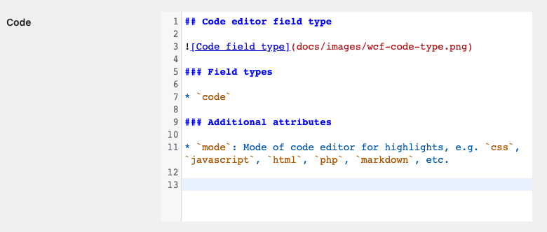


**Additional attributes**

* `mode`: Mode of code editor for highlights, e.g. `css`, `javascript`, `html`, `php`, `markdown`, etc.

## Color field type `color`

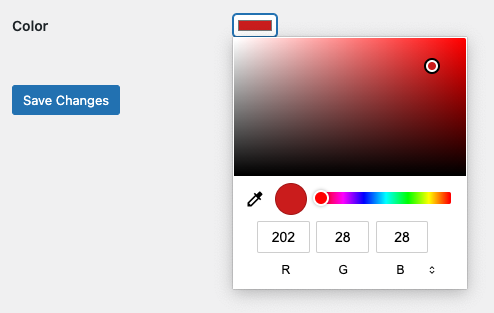


## Date field type `date`

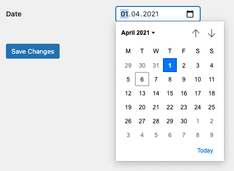

## Date and time field type `datetime`

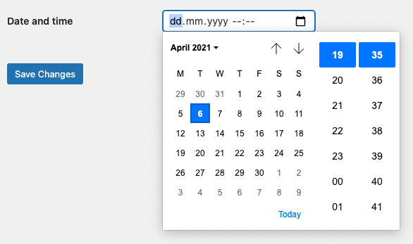

## E-mail field type `email`


## Group field type `group`, `multi_group`

### Singular groups `group`

Group field doesn't have any visual representation, but groups fields into one field. Here is an example of defining the group field in options page:

```php
wpify_custom_fields()->create_options_page( array(
   'id'          => 'example_options_page',
   'page_title'  => 'Hello custom fields',
   'menu_title'  => 'Hello WCF',
   'menu_slug'   => 'hello-wcf',
   'position'    => 1000,
   'items'       => array(
      array(
         'id'              => 'some_example_group',
         'type'            => 'group',
         'title'           => 'Group',
         'items'           => array(
            array(
               'type'            => 'text',
               'title'           => 'Text in group 1',
               'id'              => 'some_example_text_1',
            ),
            array(
               'type'            => 'text',
               'title'           => 'Text in group 2',
               'id'              => 'some_example_text_2',
            ),
         )
      ),
   ),
) );
```

The result is following:

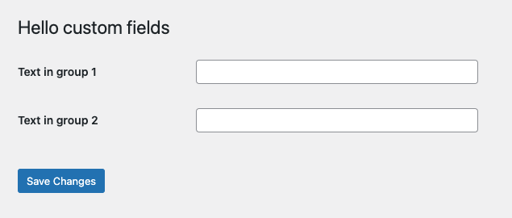;

We can now set some values and access the data:

```php
$value = get_option('some_example_group');
```

The code above will generate following array:

```php
array(
  "some_example_text_1" => "Some value 1",
  "some_example_text_2" => "Some value 2",
);
```

The groups can also be nested to get much more complicated data structures than in the example above.

### Repeated groups `multi_group`

If we change the field type in example above to `multi_group`, we'll get a different result:

```php
wpify_custom_fields()->create_options_page( array(
   'id'          => 'example_options_page',
   'page_title'  => 'Hello custom fields',
   'menu_title'  => 'Hello WCF',
   'menu_slug'   => 'hello-wcf',
   'position'    => 1000,
   'items'       => array(
      array(
         'id'              => 'some_example_group',
         'type'            => 'multi_group',
         'title'           => 'Multi group',
         'items'           => array(
            array(
               'type'            => 'text',
               'title'           => 'Text in group 1',
               'id'              => 'some_example_text_1',
            ),
            array(
               'type'            => 'text',
               'title'           => 'Text in group 2',
               'id'              => 'some_example_text_2',
            ),
         )
      ),
   ),
) );
```


The value in the custom field will be as follows:

```php
array(
    array(
        "some_example_text_1" => "Some text 1",
        "some_example_text_2" => "Some value 2",   
    ),
    array(
        "some_example_text_1" => "Some text 2",
        "some_example_text_2" => "",   
    ),
);
```

As you can see, you can add a new group with any fields inside it, move the group by drag&drop, and delete group items.

**Additional attributes**

* `items`: Array that holds the inner fields of the group.
* `min`: int, minimum number of items.
* `max`: int, maximum number of items.
* `disabled_buttons`: array, buttons that are disabled for multigroup (add|remove|duplicate|move).
* `group_title`: string, field ID inside the group, that will be used for group title.

## HTML field type `html`


**Additional attributes**

* `content`: String with HTML to render.

## Inner Blocks field type `inner_blocks`

Inner Blocks are limited in usage, please follow:

- Can be used in Gutenberg blocks only.
- Cannot be used in groups.
- Can be used one `inner_blocks` field in the block.

**Additional attributes**

* `template`: String with HTML to render.

## Link field type `link`

Field that returns an array `array( 'url' => '', 'label' => '', 'target' => null, 'post' => null )`

**Additional attributes**

* `post_type`: Name of the post type you want to link to.

## Mapy.cz field type `mapycz`

Shows the search box for location and map, where the user can set some location. The output is an object with the following shape:

```json
{
  "address": "Praha",
  "latitude": 50.0835493857,
  "longitude": 14.4341412988,
  "zoom": 12
}
```

## Month field type `month`

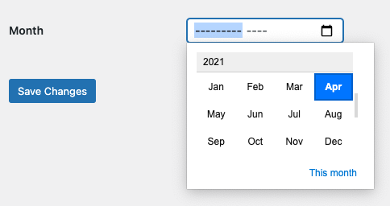

## Number field type `number`


## Password field type `password`

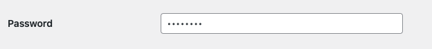

## Post field type `post`, `multi_post`

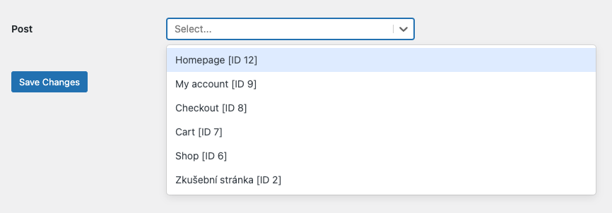
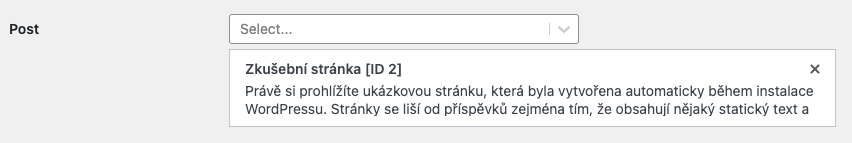

Allows selecting posts from a particular post type.

**Additional attributes**

* string `post_type`
* array `query_args`
* bool `async`

## Select field type `select`, `multi_select`

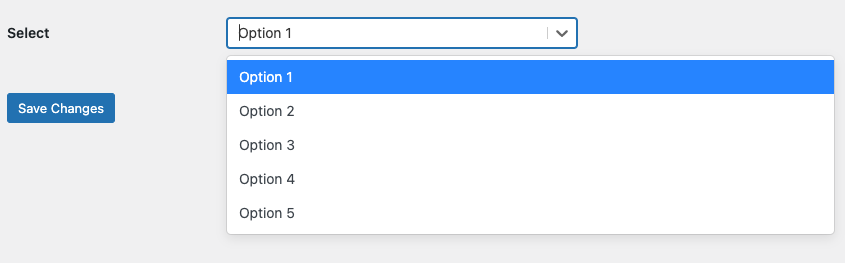

The select field can accept options asynchronously from API (recommended) or inline from `option` attribute. Each option must be an associative array with `label` and `value` keys.

**Additional attributes**
* `options` List of options or callback that return list of options with keys `value` and `label`.
* `async` If true, the options list will be loaded asynchronously.
* array `async_params` The additional GET params to the async request.

## Phone number field type `tel`

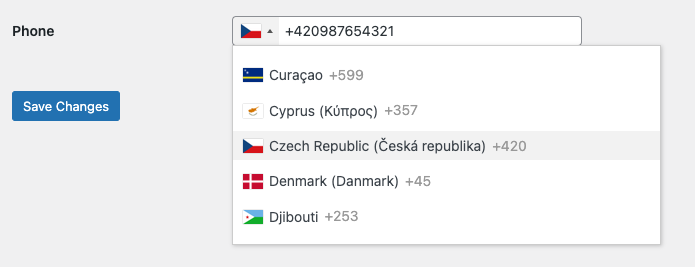

## Textarea field type `textarea`

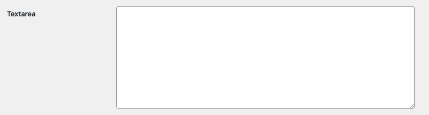

## Text field type `text`


## Time field type `time`

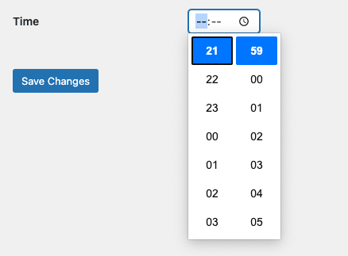

## Title field type `title`

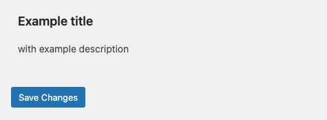

## Toggle field type `toggle`


**Additional attributes**

* `label` Label behind the toggle

## URL field type `url`

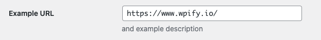

## Week field type `week`

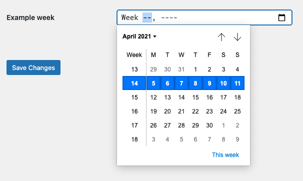

## WYSIWYG fields type `wysiwyg`

This field gives you the TinyMCE editor, that enables you edit the HTML visualy!

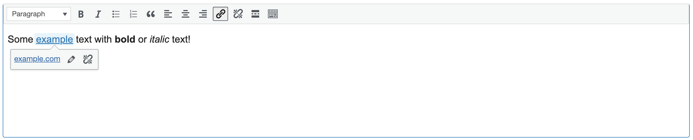

# Extending the field types

You can extend the custom field types with your own:

1. Create a React component with the field:

```jsx
import React, { useState } from 'react';

const MyCustomField = (props) => {
   const { id, className, group_level = 0, value } = props;
   const [currentValue, setCurrentValue] = useState(value);
   
   return (
     <React.Fragment>
      {group_level === 0 && ( // We need to have the input with the name only if not in group
        <input type="hidden" name={id} value={currentValue}/>
      )} 
      <input
         id={id}
         type="text"
         className={classnames('regular-text', className)}
         onChange={(e) => setCurrentValue(e.target.value)}
         value={currentValue}
      />
     </React.Fragment>
   );
};

export default MyCustomField;
```

2. Register the field:

```javascript
import { addFilter } from '@wordpress/hooks';
import { MyCustomField } from './fields/MyCustomField.js';
const type = 'my_custom_field';
addFilter('wcf_field_' + type, 'my-plugin-slug', Component => MyCustomField);
```

3. Register the parser and sanitizer (if needed)

See the code in `src/Parser.php` and `src/Sanitizer.php` for filters.

# Bedrock support

If you use Bedrock, the custom fields by default won't work, because the vendor folder is outside of the docroot and assets needed for WCF are in the vendor folder. The solution to this is move the WCF to the document root. To enable that, require "mnsami/composer-custom-directory-installer" that enables installation particular packages to another location:

`composer require mnsami/composer-custom-directory-installer`

After that, you can specify location in your `composer.json`

```json
{
  ...
  "extra": {
    "installer-paths": {
      ... 
      "web/app/vendor/{$vendor}/{$name}": [
        "wpify/custom-fields"
      ]
    },
    ...
  }
  ...
}
```

Run `composer update` and WCF is installed in `web/app/vendor/wpify/custom-fields` folder. You can then inicialize WCF as follows:

```php
$custom_fields = new CustomFields( content_url( '/app/vendor/wpify/custom-fields' ) );
```

# Advanced usage - conditional custom fields

You can customize custom fields based on data. Let's say when the user selects the white colour, you want to show background color field. That's possible thanks to filters on frontend, you can define the following in your javascript:

```javascript
import { addFilter } from '@wordpress/hooks';

addFilter('wcf_definition', 'my-plugin-test', (wcf, data) => {
  // Define when to apply filters wery carefully, if you don't want to mess with bugs!
  if (wcf.object_type === 'options_page' && wcf.menu_slug === 'some-test-menu-slug') {
		// Remove the an conditional field if present.
		const newItems = wcf.items.filter(i => i.id !== 'some_background_color');

		// If some_color is white, insert the conditional field after field ID "some_color".
		if (data.some_color === '#ffffff') {
      		// Find an index of "some_color" field.
			const index = newItems.map(i => i.id).indexOf('some_color');

      		// Insert new field after "some_color" field.
			newItems.splice(index + 1, 0, {
				id: 'some_background_color',
				title: 'Background color',
				type: 'color',
				value: data.some_background_color || '',
			});
		}

		// Return new WCF definition.
		return {
			...wcf,
			items: newItems,
		};
  }
  
  // By default, return the original WCF definition.
  return wcf;
});
```

This approach has some caveats:

* You cannot define conditional fields in multi group field type. The new items will apply to all groups in multi group.
* If you define conditions in gutenberg blocks, you need to define all attributes, or it won't be saved.

# Advanced usage - custom getters and setters

If you want to retrieve or save the field value from/to a non-default location, you can easily override the getter and setter with `callback_get` and `callback_set` arguments.

**Arguments**

* `callback_get`: callback, that will receive field definition `$item` and object id `$id`, and should return the field value
* `callback_set`: callback, that will receive field definition `$item`, object id `$id` and field value `$value`
 
The following example demonstrates saving and retrieving post meta field with `get_option` and `update_option` functions. 


```php
wpify_custom_fields()->create_metabox( array(
	'title'      => 'Details',
	'post_types' => array( 'post' ),
	'priority' => 'high',
	'items'      => array(
		array(
			'type'  => 'text',
			'title' => 'Some field',
			'id'    => 'some_field',
			'callback_get' => function($item, $id) {
				// Retrieve the value from wp_options. 
				return get_option($item['id'],'');
			},
			'callback_set' => function($item, $id, $value) {
				// Save the value to wp_options.
				update_option($item['id'],$value);
			},
			),
		),
	) 
);
```
