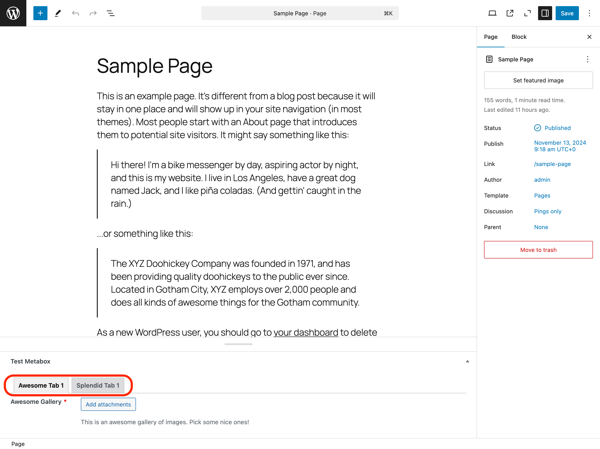

# Tabs

You can organize your custom fields into tabs for better user experience and cleaner UI. Here's how to create a tabbed metabox:

```php
wpify_custom_fields()->create_metabox(
    array(
        'id'         => 'test_metabox',
        'title'      => 'Test Metabox',
        'post_types' => array( 'page' ),
        'tabs'       => array(
            'awesome' => 'Awesome Tab 1',
            'splendid' => 'Splendid Tab 1',
        ),
        'items'      => array(
            array(
                'label'       => 'Awesome Gallery',
                'description' => 'This is an awesome gallery of images. Pick some nice ones!',
                'type'        => 'multi_attachment',
                'required'    => true,
                'tab'         => 'awesome',
            ),
            array(
                'label'       => 'Splendid Text',
                'type'        => 'text',
                'required'    => true,
                'tab'         => 'splendid',
            ),
        ),
    )
);
```

Please note, that in the metabox integration definition, the `tabs` property is an associative array where the key is the tab ID and the value is the tab title. The `tab` property in the field definition refers to the tab ID where the field should be displayed.

With this example, you can see the tabs in action. The metabox will have two tabs: "Awesome Tab 1" and "Splendid Tab 1". The "Awesome Gallery" field will be displayed in the "Awesome Tab 1" tab, and the "Splendid Text" field will be displayed in the "Splendid Tab 1" tab.


