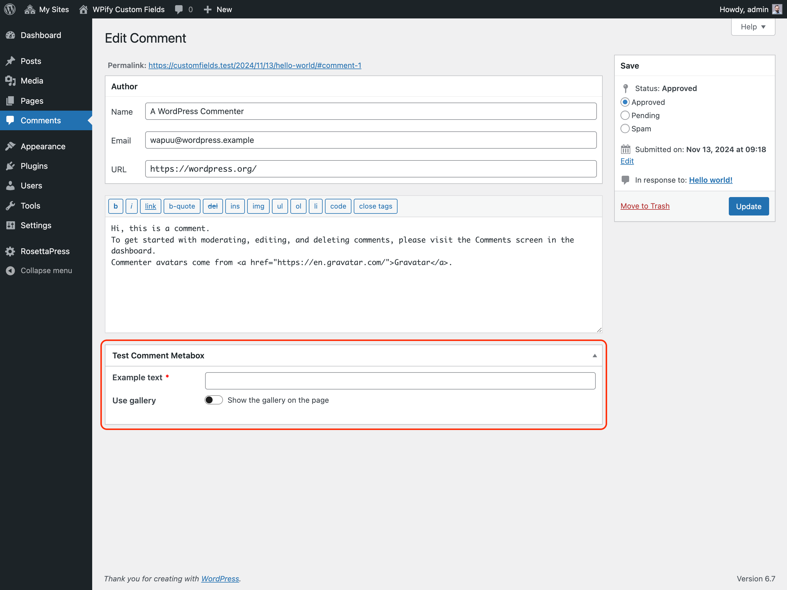

# Comment Metabox

Comments metabox integrates custom fields into comment edit screen:

## Preview


Example URL: `/wp-admin/comment.php?action=editcomment&c=1`

## Example

```php
wpify_custom_fields()->create_comment_metabox(
    array(
        'id'    => 'test_comment_metabox',
        'title' => 'Test Comment Metabox',
        'tabs'       => array(
            'awesome' => 'Awesome Tab',
        ),
        'items' => array(
            'example_text' => array(
                'type' => 'text',
                'label' => 'Example text',
                'required' => true,
                'tab' => 'awesome',
            ),
            'use_gallery' => array(
                'type' => 'toggle',
                'label' => 'Use gallery',
                'title' => 'Show the gallery on the page',
                'tab' => 'awesome',
            ),
            'gallery' => array(
                'type' => 'multi_attachment',
                'label' => 'Gallery',
                'tab' => 'awesome',
                'conditions' => array(
                    array( 'field' => 'use_gallery', 'value' => true ),
                ),
            ),
        ),
        /* other arguments */
    ),
);
```

## Arguments

### `$id` *string*

Meta box ID (used in the 'id' attribute for the meta box).

### `$title` *string*

Title of the meta box.

### `$tabs` *array*

Tabs used for the custom fields. See [Tabs](../features/tabs.md) for more information.

### `$items` *array*

List of the fields to be shown. See [Field Types](../field-types.md) for available field types.

### `$callback_args` *array*

Data that should be set as the `$args` property of the box array (which is the second parameter passed to your
callback).

### `$meta_key` *string*

Meta key used to store the custom fields values. If meta key is not set, the individual fields will be stored as separate
meta values.
