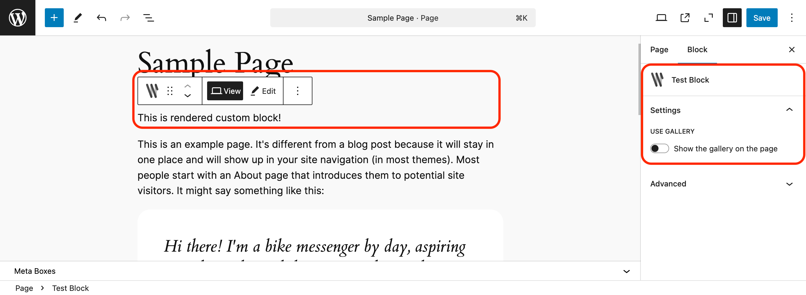
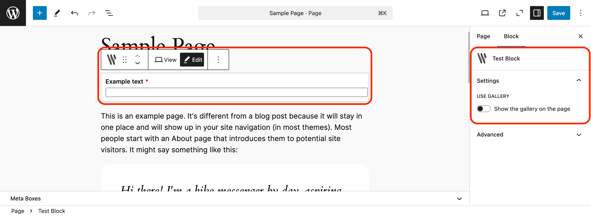

# Gutenberg Block

You can create custom Gutenberg Blocks using WPify Custom Fields. 

## Preview

### Block preview



### Edit interface



## Example

```php
wpify_custom_fields()->create_gutenberg_block(
    array(
        'name'            => 'wpify/custom-block',
        'title'           => 'Test Block',
        'render_callback' => function ( array $attributes, string $content, WP_Block $block ) {
            return '<p>This is rendered custom block!</p>';
        },
        'tabs'            => array(
            'awesome' => 'Awesome Tab',
        ),
        'items'           => array(
            'example_text' => array(
                'type'     => 'text',
                'label'    => 'Example text',
                'required' => true,
                'tab'      => 'awesome',
            ),
            'use_gallery'  => array(
                'type'     => 'toggle',
                'label'    => 'Use gallery',
                'title'    => 'Show the gallery on the page',
                'position' => 'inspector'
            ),
            'gallery'      => array(
                'type'       => 'multi_attachment',
                'label'      => 'Gallery',
                'tab'        => 'awesome',
                'conditions' => array(
                    array( 'field' => 'use_gallery', 'value' => true ),
                ),
            ),
            'inner_blocks' => array(
                'type'        => 'inner_blocks',
                'label'       => 'Inner Blocks',
                'description' => 'Inner Blocks description',
                'tab'         => 'special',
            ),
        ),
    ),
);
```

## Arguments

Read more about arguments and it's values in WordPress documentation for [register_block_type](https://developer.wordpress.org/reference/functions/register_block_type/).

### `$name` *string*

Block type name including namespace.

### `$api_version` *string*

API version of the block. Default `3`.

### `$title` *string*

Human-readable block type label.

### `$category` *string|null*

Block type category classification, used in search interfaces to arrange block types by category.

### `$parent` *string[]|null*

Setting parent lets a block require that it is only available when nested within the specified blocks.

### `$ancestor` *string[]|null*

Setting ancestor makes a block available only inside the specified block types at any position of the ancestor’s block subtree.

### `$allowed_blocks` *string[]|null*

Limits which block types can be inserted as children of this block type.

### `$icon` *string|null*

The URL to the icon to be used for this menu.

- Pass a base64-encoded SVG using a data URI, which will be colored to match the color scheme. This should begin with 'data:image/svg+xml;base64,'.
- Pass the name of a Dashicons helper class to use a font icon, e.g. 'dashicons-chart-pie'.

### `$description` *string*

A detailed block type description.

### `$keywords` *string[]*

Additional keywords to produce block type as result in search interfaces.

### `$textdomain` *string|null*

The translation textdomain.

### `$styles` *array[]*

Alternative block styles.

### `$variations` *array[]*

Block variations.

### `$selectors` *array*

Custom CSS selectors for theme.json style generation.

### `$supports` *array|null*

Supported features.

### `$example` *array|null*

Structured data for the block preview.

### `$render_callback` *callable*

Block type render callback - function that renders the block on the front end.

### `$variation_callback` *callable|null*

Block type variations callback.

### `$uses_context` *string[]*

Context values inherited by blocks of this type.

### `$provides_context` *string[]*

Context provided by blocks of this type.

### `$block_hooks` *string[]*

Block hooks.

### `$editor_script_handles` *string[]*

Block type editor only script handles.

### `$script_handles` *string[]*

Block type front end and editor script handles.

### $view_script_handles *string[]*

Block type front end only script handles.

### `$style_handles` *string[]*

Block type front end and editor style handles.

### `$view_style_handles` *string[]*

Block type front end only style handles.

### `$view_style_handles` *string[]*

Block type front end only style handles.

### `$tabs` *array*

Tabs used for the custom fields. See [Tabs](../features/tabs.md) for more information.

### `$items` *array*

List of the fields to be shown. See [Field Types](../field-types.md) for available field types.
