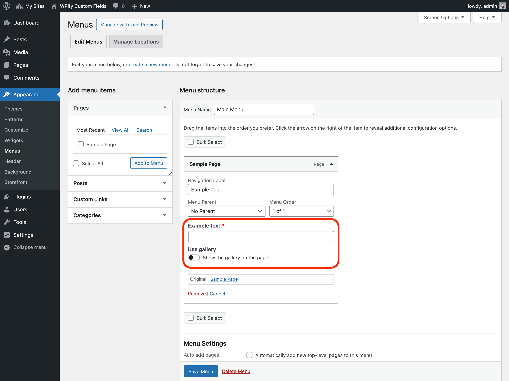

# Menu Items

Add custom fields to the menu items. 

## Preview



## Example

```php
wpify_custom_fields()->create_menu_item_options(
    array(
        'id'    => 'test_menu_item_options',
        'title' => 'Test Menu Item Options',
        'tabs'  => array(
            'awesome' => 'Awesome Tab',
        ),
        'items' => array(
            'example_text' => array(
                'type'     => 'text',
                'label'    => 'Example text',
                'required' => true,
                'tab'      => 'awesome',
            ),
            'use_gallery'  => array(
                'type'     => 'toggle',
                'label'    => 'Use gallery',
                'title'    => 'Show the gallery on the page',
                'position' => 'inspector'
            ),
            'gallery'      => array(
                'type'       => 'multi_attachment',
                'label'      => 'Gallery',
                'tab'        => 'awesome',
                'conditions' => array(
                    array( 'field' => 'use_gallery', 'value' => true ),
                ),
            ),
            'inner_blocks' => array(
                'type'        => 'inner_blocks',
                'label'       => 'Inner Blocks',
                'description' => 'Inner Blocks description',
                'tab'         => 'special',
            ),
        ),
    ),
);
```

## Arguments

Read more about arguments and it's values in WordPress documentation for [register_block_type](https://developer.wordpress.org/reference/functions/register_block_type/).

### `$id` *string*

Implementation ID.

### `$title` *string*

Title of the meta box.

### `$tabs` *array*

Tabs used for the custom fields. See [Tabs](../features/tabs.md) for more information.

### `$items` *array*

List of the fields to be shown. See [Field Types](../field-types.md) for available field types.

### `$meta_key` *string*

Meta key used to store the custom fields values. If meta key is not set, the individual fields will be stored as separate
meta values.
