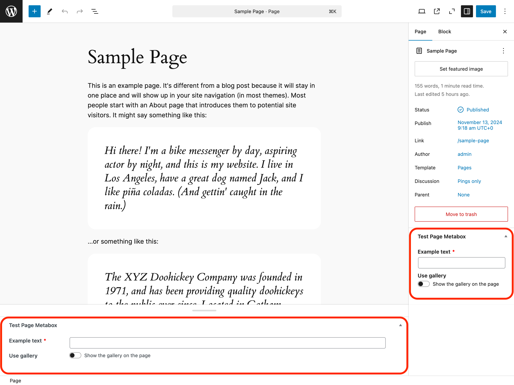

# Post Metabox

Post Metabox integrates custom fields into post edit screen:

## Preview


Example URL: `/wp-admin/post.php?post=2&action=edit`

## Example

```php
wpify_custom_fields()->create_metabox(
    array(
        'id' => 'test_page_metabox',
        'title' => 'Test Page Metabox',
        'post_types' => array( 'page' ),
        'priority' => \Wpify\CustomFields\Integrations\Metabox::PRIORITY_HIGH,
        'tabs' => array(
            'awesome' => 'Awesome Tab',
        ),
        'items' => array(
            'example_text' => array(
                'type' => 'text',
                'label' => 'Example text',
                'required' => true,
                'tab' => 'awesome',
            ),
            'use_gallery' => array(
                'type' => 'toggle',
                'label' => 'Use gallery',
                'title' => 'Show the gallery on the page',
                'tab' => 'awesome',
            ),
            'gallery' => array(
                'type' => 'multi_attachment',
                'label' => 'Gallery',
                'tab' => 'awesome',
                'conditions' => array(
                    array( 'field' => 'use_gallery', 'value' => true ),
                ),
            ),
        ),
        /* other arguments */
    ),
);
```

## Arguments

Read more about arguments and it's values in [WordPress documentation](https://developer.wordpress.org/reference/functions/add_meta_box/).

### `$id` *string*

Meta box ID (used in the 'id' attribute for the meta box).

### `$title` *string*

Title of the meta box.

### `$tabs` *array*

Tabs used for the custom fields. See [Tabs](../features/tabs.md) for more information.

### `$items` *array*

List of the fields to be shown. See [Field Types](../field-types.md) for available field types.

### `$screen` **string|array|WP_Screen|null**

The screen or screens on which to show the box.

### `$context` *string*

The context within the screen where the box should display. Available contexts vary from screen to screen. Post edit screen contexts include 'normal', 'side', and 'advanced'.

### `$priority` *string*

The priority within the context where the box should show. Accepts 'high', 'core', 'default', or 'low'.
You can use constants:

```php
\Wpify\CustomFields\Integrations\Metabox::PRIORITY_HIGH    = 'high'
\Wpify\CustomFields\Integrations\Metabox::PRIORITY_CORE    = 'core'
\Wpify\CustomFields\Integrations\Metabox::PRIORITY_LOW     = 'low'
\Wpify\CustomFields\Integrations\Metabox::PRIORITY_DEFAULT = 'default'
```

### `$callback_args` *array*

Data that should be set as the $args property of the box array (which is the second parameter passed to your callback).

### `$post_types` *array*

Post Types where to show the custom fields.

### `$meta_key` *string*

Meta key used to store the custom fields values. If meta key is not set, the individual fields will be stored as separate
meta values.
