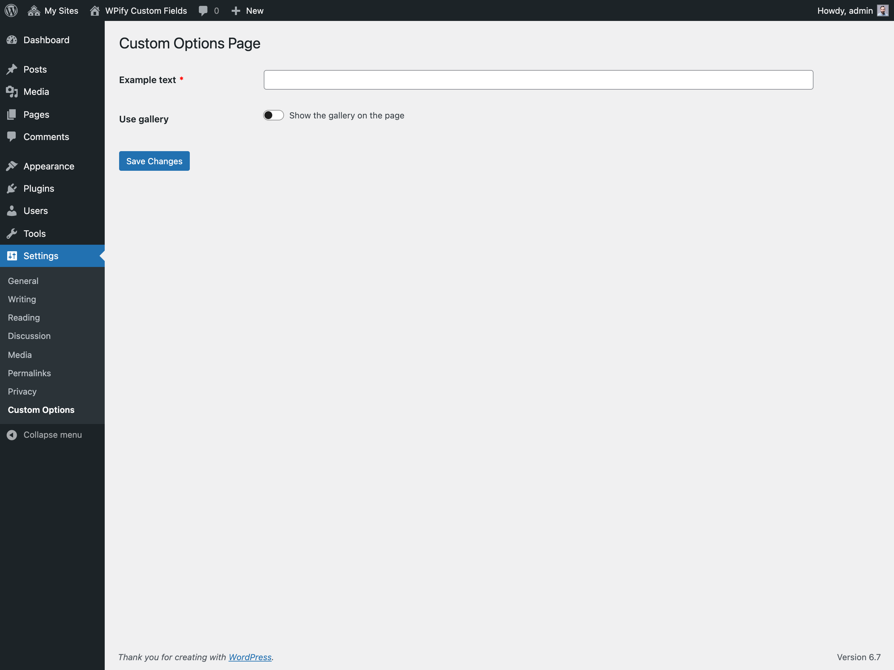

# Options page

You can create a custom options page with custom fields using WPify Custom Fields.
With `create_options_page` method, you can create subpages, pages on the top level in menu,
options page in multisite network, in the user submenu, or on user page.

## Preview


Example URL: `/wp-admin/options-general.php?page=custom-options`

## Example

```php
wpify_custom_fields()->create_options_page(
    array(
        'type'            => \Wpify\CustomFields\Integrations\Options::TYPE_OPTIONS,
        'parent_slug'     => 'options-general.php',
        'page_title'      => 'Custom Options Page', // only if you want to create page
        'menu_title'      => 'Custom Options', // only if you want to create page
        'menu_slug'       => 'custom-options', // only if you want to create page
        'hook_suffix'     => 'toplevel_page_custom-options', // only if you want to use existing page
        'capability'      => 'manage_options',
        'position'        => 100,
        'hook_priority'   => 10,
        'option_name'     => 'test_options_key',
        'success_message' => 'Changes has been saved.',
        'tabs'            => array(
            'awesome' => 'Awesome Tab',
        ),
        'items'           => array(
            'example_text' => array(
                'type'     => 'text',
                'label'    => 'Example text',
                'required' => true,
                'tab'      => 'awesome',
            ),
            'use_gallery'  => array(
                'type'  => 'toggle',
                'label' => 'Use gallery',
                'title' => 'Show the gallery on the page',
                'tab'   => 'awesome',
            ),
            'gallery'      => array(
                'type'       => 'multi_attachment',
                'label'      => 'Gallery',
                'tab'        => 'awesome',
                'conditions' => array(
                    array( 'field' => 'use_gallery', 'value' => true ),
                ),
            ),
        ),
    ),
);
```

## Arguments

Read more about arguments and it's values in WordPress documentation for [add_menu_page](https://developer.wordpress.org/reference/functions/add_menu_page/) and [add_submenu_page](https://developer.wordpress.org/reference/functions/add_submenu_page/).

### `$id` *string*

Meta box ID (used in the 'id' attribute for the meta box).

### `$type` *string*'

Type of the options page. Possible values are 'options', 'network', 'user_submenu', 'user'.

### `$parent_slug` *string*

The slug name for the parent menu (or the file name of a standard WordPress admin page). Use only if `hook_suffix` argument is not set.

### `$page_title` *string*

The text to be displayed in the title tags of the page when the menu is selected. Use only if `hook_suffix` argument is not set.

### `$menu_title` *string*

The text to be used for the menu. Use only if `hook_suffix` argument is not set.

### `$hook_suffix` *string*

The hook suffix (the result of `add_menu_page`, `add_submenu_page` or `add_users_page`). Use if you want to render custom fields on the existing page. In that case, don't use arguments `page_title`, `menu_title`, `menu_slug`.

### `$capability` *string*

The capability required for this menu to be displayed to the user.

### `$menu_slug` *string*

The slug name to refer to this menu by. Should be unique for this menu and only include lowercase alphanumeric, dashes, and underscores characters to be compatible with sanitize_key().

### `$callback` *callable*

The function to be called to output the content for this page.

### `$icon_url` *string*

The URL to the icon to be used for this menu.

- Pass a base64-encoded SVG using a data URI, which will be colored to match the color scheme. This should begin with 'data:image/svg+xml;base64,'.
- Pass the name of a Dashicons helper class to use a font icon, e.g. 'dashicons-chart-pie'.
- Pass 'none' to leave div.wp-menu-image empty so an icon can be added via CSS.

### `$position` *int*

The position in the menu order this menu should appear.

### `$hook_priority` *int*

The priority within the action at which the menu should be added.

### `$display` *callable*

Callback that returns boolean that defines if custom fields should be shown.

### `$submit_button` *string|array|bool*

Submit button definition. It can be one of the following types:

* **Array** `[ 'text' => 'Save Changes', 'type' => 'primary', ... ]`. See [submit_button](https://developer.wordpress.org/reference/functions/submit_button/) function for reference.
* **String** with the text of the button.
* **Boolean** `false` to hide the button.

### `$success_message` *string*

Success message to be shown after saving the options.

### `$sections` *array*

List of the sections to be defined. See [Settings API](https://developer.wordpress.org/plugins/settings/settings-api/) for more information.

Sections are defined as an array with the key name as section ID and the value for the section title.

```php
$sections = array(
    'section_1_id' => 'Section 1 Title',
    'section_2_id' => 'Section 2 Title',
);
```

You can than use the section ID in the field definition to add the field to the section. If the section ID is not set, the field will be added to the default section.

```php
$field = array(
    'label'    => 'Example text',
    'type'     => 'text',
    'section'  => 'section_1_id',
);
```

### `$default_section` *string*

Default section name.

### `$option_group` *string*

A settings group name. This should match the group name in register_setting().

### `$option_name` *string*

Option Name used to store the custom fields values. If not set, the individual fields will be stored as separate options.

### `$tabs` *array*

Tabs used for the custom fields. See [Tabs](../features/tabs.md) for more information.

### `$items` *array*

List of the fields to be shown. See [Field Types](../field-types.md) for available field types.

## Different places where to create options page

### Top level menu page

```php
wpify_custom_fields()->create_options_page(
    array(
        'type'        => \Wpify\CustomFields\Integrations\Options::TYPE_OPTIONS,
        'page_title'  => 'Custom Options Page',
        'menu_title'  => 'Custom Options',
        'option_name' => 'custom-options',
        ...
    ),
);
```
Example URL: `/wp-admin/admin.php?page=custom-options`

### Submenu page

```php
wpify_custom_fields()->create_options_page(
    array(
        'type'        => \Wpify\CustomFields\Integrations\Options::TYPE_OPTIONS,
        'parent_slug' => 'options-general.php',
        'page_title'  => 'Custom Options Page',
        'menu_title'  => 'Custom Options',
        'option_name' => 'custom-options',
        ...
    ),
);
```
Example URL: `/wp-admin/options-general.php?page=custom-options`

Possible slugs for `parent_slug` parameter:

* Dashboard: `index.php`
* Posts: `edit.php`
* Media: `upload.php`
* Pages: `edit.php?post_type=page`
* Comments: `edit-comments.php`
* Appearance: `themes.php`
* Plugins: `plugins.php`
* Users: `users.php`
* Tools: `tools.php`
* Settings: `options-general.php`
* Custom Post Types: `edit.php?post_type=custom_post_type`

### Top level network menu page

```php
wpify_custom_fields()->create_options_page(
    array(
        'type'        => \Wpify\CustomFields\Integrations\Options::TYPE_NETWORK,
        'page_title'  => 'Custom Options Page',
        'menu_title'  => 'Custom Options',
        'option_name' => 'custom-options',
        ...
    ),
);
```
Example URL: `/wp-admin/network/admin.php?page=custom-options`

### Submenu network page

```php
wpify_custom_fields()->create_options_page(
    array(
        'type'        => \Wpify\CustomFields\Integrations\Options::TYPE_OPTIONS,
        'parent_slug' => 'settings.php',
        'page_title'  => 'Custom Options Page',
        'menu_title'  => 'Custom Options',
        'option_name' => 'custom-options',
        ...
    ),
);
```
Example URL: `/wp-admin/network/settings.php?page=custom-options`

Possible slugs for `parent_slug` parameter:

* Dashboard: `index.php`
* Sites: `sites.php`
* Users: `users.php`
* Themes: `themes.php`
* Plugins: `plugins.php`
* Network Settings: `settings.php`

### User submenu page

```php
wpify_custom_fields()->create_options_page(
    array(
        'type'        => \Wpify\CustomFields\Integrations\Options::TYPE_USER_SUBMENU,
        'page_title'  => 'Custom Options Page',
        'menu_title'  => 'Custom Options',
        'option_name' => 'custom-options',
        ...
    ),
);
```
Example URL: 
* `/wp-admin/users.php?page=custom-options`
* `/wp-admin/profile.php?page=custom-options`

### User page

```php
wpify_custom_fields()->create_options_page(
    array(
        'type'        => \Wpify\CustomFields\Integrations\Options::TYPE_USER,
        'page_title'  => 'Custom Options Page',
        'menu_title'  => 'Custom Options',
        'option_name' => 'custom-options',
        ...
    ),
);
```
Example URL: `/wp-admin/user/admin.php?page=custom-options`
